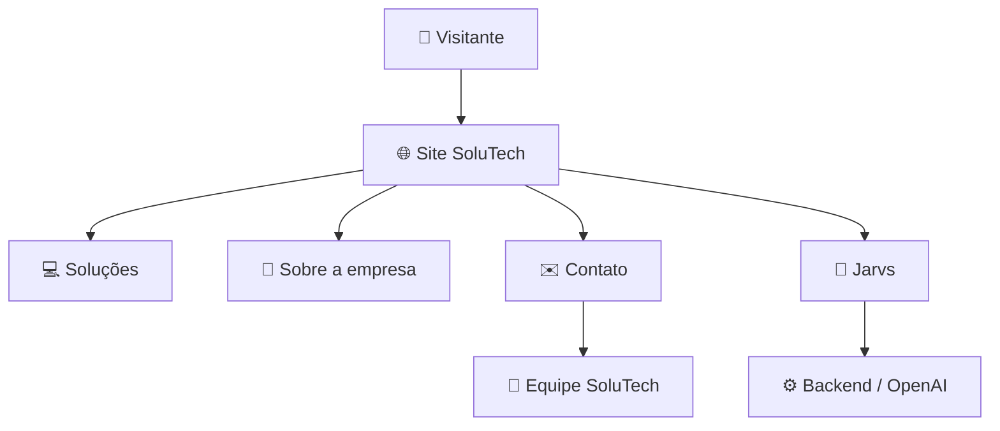
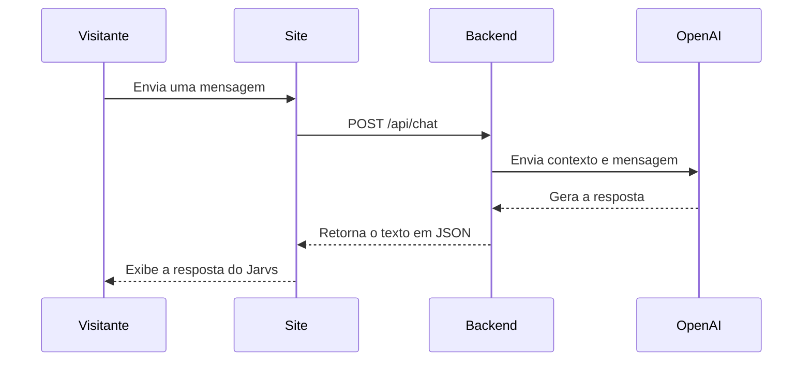
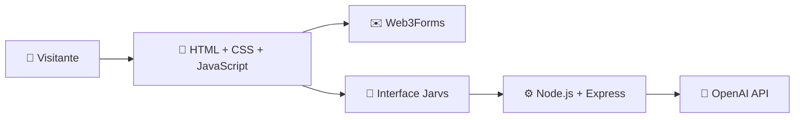
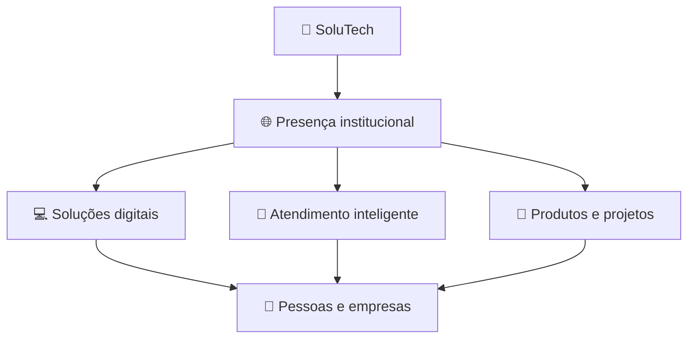

<div align="center">


<br>


<br><br>


<br><br>

Site institucional da **SoluTech**, uma fábrica de software focada em transformar necessidades reais em soluções digitais inteligentes, seguras e personalizadas.

</div>

---

# 📌 Sobre o projeto

Este repositório contém o desenvolvimento do **site institucional da SoluTech**.

A SoluTech é uma fábrica de software voltada à criação de aplicações web e mobile, automação de processos, inteligência artificial, inteligência de dados e consultoria tecnológica. A empresa busca trabalhar em conjunto com seus clientes, entendendo cada necessidade antes de propor a solução mais adequada.

O site funciona como a principal presença digital da empresa. Seu objetivo é apresentar a marca, explicar as áreas de atuação, mostrar como a tecnologia pode atender pessoas e empresas e criar canais de contato com a equipe.

> **Inovação que resolve.**  
> Sua ideia. Nossa tecnologia.

---

# 🎯 Objetivos do site

- Apresentar a SoluTech e sua identidade institucional;
- Divulgar as soluções oferecidas pela empresa;
- Atender pessoas físicas e empresas;
- Explicar a missão e a visão da organização;
- Disponibilizar um canal direto de contato;
- Auxiliar visitantes por meio do assistente virtual Jarvs;
- Criar uma base para futuras páginas, produtos e integrações;
- Fortalecer a presença digital da empresa.

---

# 🧭 Visão geral



---

# 🌐 Seções da página

| Seção | Finalidade | Status |
|---|---|---|
| 🏠 **Início** | Apresentar a proposta principal e a identidade da SoluTech | ✅ Concluída |
| 💡 **Soluções** | Exibir as principais áreas de atuação da empresa | ✅ Concluída |
| 👤 **Para Pessoas** | Mostrar soluções voltadas às necessidades individuais | ✅ Concluída |
| 🏢 **Para Empresas** | Apresentar serviços para negócios e organizações | ✅ Concluída |
| 🧭 **Sobre Nós** | Apresentar missão, visão e horizonte da empresa | ✅ Concluída |
| ✉️ **Contato** | Reunir informações e permitir o envio de mensagens | ✅ Funcional |
| 🤖 **Jarvs** | Atender visitantes com apoio de inteligência artificial | 🟡 Em evolução |
| 🤝 **Clientes** | Área destinada a futuros clientes e projetos realizados | ⚪ Planejada |

---

# 💡 Soluções apresentadas

O site organiza a atuação da SoluTech em quatro áreas principais:

| Área | Descrição |
|---|---|
| 💻 **Tecnologia** | Desenvolvimento de sistemas e automações para otimizar processos e aumentar a produtividade |
| 🧭 **Consultoria** | Apoio especializado para decisões estratégicas relacionadas a processos e tecnologia |
| 🤖 **Inteligência Artificial** | Uso de IA para automatizar tarefas, economizar tempo e apoiar novas soluções |
| 📊 **Inteligência de Dados** | Transformação de dados em informações úteis para decisões e oportunidades |

A proposta não é limitar a empresa a soluções prontas. A SoluTech também pode analisar demandas específicas e desenvolver projetos personalizados de acordo com cada necessidade.

---

# 🤖 Jarvs — Assistente virtual

O **Jarvs** é o assistente virtual da SoluTech e foi integrado ao site para oferecer uma experiência de atendimento mais próxima e interativa.

Ele pode ser acessado pelo botão disponível no cabeçalho ou pelo botão flutuante no canto da página. Os dois controles abrem a mesma janela de conversa.

## O que o Jarvs faz

- Apresenta as áreas de atuação da SoluTech;
- Ajuda o visitante a compreender as soluções disponíveis;
- Procura entender o problema antes de sugerir um caminho;
- Responde em português brasileiro;
- Mantém uma comunicação profissional, amigável e direta;
- Encaminha oportunidades de orçamento ou contratação para a equipe;
- Evita inventar preços, clientes ou informações não fornecidas pela empresa.

## Fluxo da conversa



A chave da API permanece no servidor por meio de uma variável de ambiente. Ela não deve ser colocada no HTML, no JavaScript do navegador ou enviada para o GitHub.

---

# ✉️ Formulário de contato

O formulário permite que visitantes enviem mensagens diretamente pelo site. A integração atual utiliza o **Web3Forms**, evitando a necessidade de criar uma rota própria somente para o envio dos dados do formulário.

Os campos disponíveis são:

- Nome;
- E-mail;
- Assunto;
- Mensagem.

O JavaScript controla o envio, informa se a operação foi concluída e limpa os campos após o sucesso.

---

# 🧱 Arquitetura atual

O projeto possui uma interface estática e um pequeno backend responsável pelo Jarvs.



| Camada | Tecnologia | Responsabilidade |
|---|---|---|
| 🎨 **Estrutura** | HTML5 | Organização semântica do conteúdo |
| 🖌️ **Estilo** | CSS3 | Identidade visual, animações e responsividade |
| ⚡ **Interatividade** | JavaScript | Menu, navegação ativa, Jarvs e formulário |
| ⚙️ **Servidor** | Node.js + Express | Hospedagem local e rota do assistente virtual |
| 🧠 **Inteligência artificial** | OpenAI API | Geração das respostas do Jarvs |
| ✉️ **Mensagens** | Web3Forms | Processamento do formulário de contato |
| 📦 **Dependências** | npm | Gerenciamento dos pacotes do backend |
| 🔀 **Versionamento** | Git + GitHub | Histórico e armazenamento do código |

---

# 📂 Estrutura do projeto

```text
SoluTech/
│
├── img/
│   ├── Banner2.png
│   ├── banner_contato.png
│   ├── card1.png
│   ├── card2.png
│   ├── jarvs1.png
│   ├── logo.png
│   ├── logo_1.png
│   └── logo_2.png
│
├── server/
│   ├── .env
│   ├── package.json
│   ├── package-lock.json
│   └── server.js
│
├── .gitattributes
├── .gitignore
├── Diario de um dev.txt
├── index.html
├── Js_Json_.env.txt
├── LICENSE
├── README.md
├── script.js
└── style.css
```

> A pasta `node_modules` é criada pelo npm e não deve ser enviada para o repositório. O arquivo `.env` também deve permanecer apenas no ambiente local.

---

# 🛠️ Tecnologias utilizadas

<div align="center">


<br><br>


</div>

---

# 🚀 Como executar o projeto

## Pré-requisitos

Antes de começar, é necessário possuir:

- [Node.js](https://nodejs.org/) instalado;
- npm, incluído na instalação do Node.js;
- Uma chave válida da OpenAI API para utilizar o Jarvs.

## 1. Clonar o repositório

```bash
git clone https://github.com/DaviMattoso/SoluTech.git
cd SoluTech/server
```

## 2. Instalar as dependências

```bash
npm install
```

## 3. Configurar as variáveis de ambiente

Crie um arquivo chamado `.env` dentro da pasta `server`:

```env
OPENAI_API_KEY=sua_chave_da_openai_aqui
```

Nunca publique esse arquivo ou uma chave verdadeira no repositório.

## 4. Iniciar o servidor

```bash
npm start
```

Depois, acesse no navegador:

```text
http://localhost:3000
```

---

# 📱 Responsividade e experiência

O layout foi criado para se adaptar a diferentes tamanhos de tela.

Entre os comportamentos responsivos já implementados estão:

- Menu móvel com controle de abertura e fechamento;
- Ajustes específicos para telas de até `1024px`;
- Layout móvel para telas de até `600px`;
- Reorganização dos cards e blocos de conteúdo;
- Formulário adaptado para uma coluna no celular;
- Janela do Jarvs ajustada à altura e largura disponíveis;
- Imagens redimensionadas sem perder a proposta visual;
- Navegação com indicação automática da seção ativa.

---

# 🧭 Missão e visão

## Missão

Transformar necessidades em soluções de software inovadoras, utilizando a tecnologia para resolver os desafios dos clientes. A SoluTech busca excelência técnica por meio de relacionamentos éticos, transparentes e humanizados com clientes, parceiros, fornecedores e colaboradores.

## Visão

Ser uma empresa de referência no desenvolvimento de software, reconhecida pela qualidade das entregas e pela excelência nas relações humanas, tendo **2031** como horizonte de crescimento.

---

# 🤝 Princípios da SoluTech

- **Inovação responsável:** criar soluções com impactos positivos e sustentáveis;
- **Transparência:** agir com clareza nas relações técnicas e comerciais;
- **Foco no ser humano:** considerar pessoas e necessidades reais em cada processo;
- **Integridade:** manter padrões éticos mesmo diante de pressões;
- **Segurança e privacidade:** proteger os dados tratados pela empresa;
- **Qualidade de entrega:** evitar atalhos que comprometam a estabilidade dos sistemas;
- **Respeito e diversidade:** manter um ambiente livre de discriminação e assédio;
- **Uso responsável de IA:** aplicar inteligência artificial de forma justa e auditável;
- **Melhoria contínua:** investir na evolução técnica dos produtos e da equipe.

---

# 🚧 Roadmap

## Estrutura institucional

- [x] Identidade visual inicial;
- [x] Cabeçalho e navegação;
- [x] Seção principal;
- [x] Apresentação das soluções;
- [x] Conteúdo para pessoas e empresas;
- [x] Missão e visão;
- [x] Rodapé institucional;
- [ ] Seção de clientes e projetos realizados;
- [ ] Páginas individuais para cada solução;
- [ ] Links oficiais das redes sociais;
- [ ] Política de Privacidade;
- [ ] Termos de Uso.

## Experiência e responsividade

- [x] Menu para dispositivos móveis;
- [x] Navegação com seção ativa;
- [x] Layout responsivo inicial;
- [ ] Revisão completa em diferentes navegadores;
- [ ] Melhorias de acessibilidade;
- [ ] Otimização das imagens;
- [ ] Revisão e organização final do CSS;
- [ ] Testes de desempenho.

## Integrações

- [x] Estrutura visual do Jarvs;
- [x] Backend com Node.js e Express;
- [x] Rota `/api/chat`;
- [x] Integração com a OpenAI API;
- [x] Formulário com Web3Forms;
- [ ] Criar e vincular o e-mail oficial da empresa;
- [ ] Ampliar o conhecimento institucional do Jarvs;
- [ ] Implementar proteção contra abuso e limite de requisições;
- [ ] Preparar o backend para ambiente de produção;
- [ ] Publicar o site.

---

# 📓 Diário de um Dev

O repositório possui o arquivo:

```text
Diario de um dev.txt
```

Ele registra o processo de construção do site, incluindo decisões, erros, correções, testes e aprendizados.

Entre os assuntos já documentados estão:

- Construção das seções da landing page;
- Organização e responsividade do layout;
- Desenvolvimento do menu móvel;
- Correção da linha de navegação ativa;
- Criação da interface do Jarvs;
- Diferença entre front-end e backend;
- Instalação e configuração do Node.js;
- Uso do Express e de variáveis de ambiente;
- Criação da rota `/api/chat`;
- Integração com a OpenAI;
- Criação e integração do formulário de contato.

A proposta é documentar não apenas o código final, mas também o caminho percorrido durante o desenvolvimento.

---

# 🔐 Segurança

Este projeto utiliza serviços externos e exige alguns cuidados:

- Nunca colocar a chave da OpenAI no front-end;
- Nunca publicar arquivos `.env`;
- Não versionar a pasta `node_modules`;
- Manter dados e chaves de produção fora do código-fonte;
- Validar as mensagens recebidas pelo backend;
- Aplicar limites de requisição antes da publicação;
- Revisar a política de privacidade antes de coletar dados reais.

---

# 📌 Status atual

> 🚧 **Projeto em desenvolvimento**

A estrutura principal do site já está construída e responsiva. O formulário de contato foi integrado, e o Jarvs já possui interface, backend e comunicação com a API da OpenAI.

As próximas etapas estão concentradas na revisão do código, otimização, acessibilidade, finalização dos conteúdos institucionais, preparação segura do backend e publicação.

---

# 🎯 Objetivo final

O objetivo é transformar o site em uma apresentação completa da SoluTech e em uma porta de entrada para seus produtos e serviços.



O site deverá crescer junto com a empresa, apresentando novos sistemas, projetos, clientes, conteúdos e formas de atendimento conforme a SoluTech avança.

---

# 📄 Licença

Este projeto está disponível sob a licença **MIT**. Consulte o arquivo [`LICENSE`](LICENSE) para mais informações.

---

<div align="center">

## SoluTech

### Inovação que resolve.

<br>


<br><br>

**Tecnologia • Consultoria • Inteligência Artificial • Inteligência de Dados**

<br>

Construindo soluções, corrigindo caminhos e transformando ideias em tecnologia. 🚀

<br><br>


</div>
